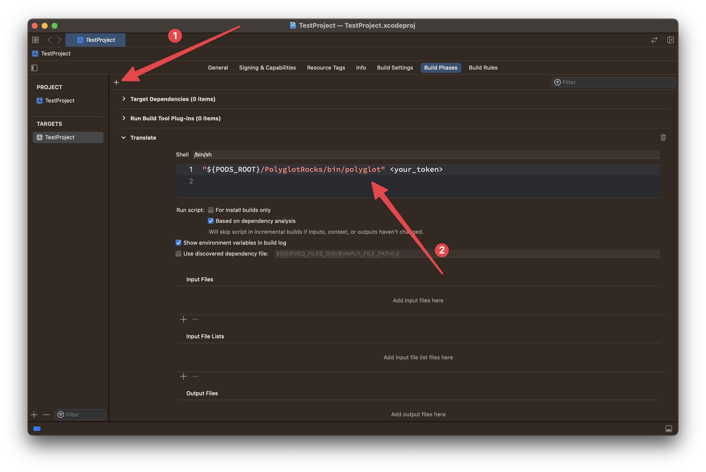

# Polyglot

<p align="left">
  
  
  
</p>

Polyglot is a localization tool that simplifies the translation process of your iOS mobile application. Our SDK can process `.strings` files and provide fast and accurate translations using AI-powered technology, as well as manual ones a bit later. By using Polyglot, you can easily translate your app into multiple languages and reach a wider audience with minimal effort.

## Contents

- [Polyglot](#polyglot)
  - [Contents](#contents)
  - [Vocabulary](#vocabulary)
  - [Integration options](#integration-options)
    - [Option 1. CocoaPods](#option-1-cocoapods)
    - [Option 2. cURL (Xcode)](#option-2-curl-xcode)
    - [Option 3. cURL (Manually)](#option-3-curl-manually)
    - [Option 4. GitHub Actions](#option-4-github-actions)
    - [Option 5. Docker](#option-5-docker)
  - [Support](#support)
    - [How do I add a new localization?](#how-do-i-add-a-new-localization)
    - [Should I commit translations to the git history?](#should-i-commit-translations-to-the-git-history)
  - [License](#license)

## Vocabulary

To use Polyglot, you will need or may need the following parameters:

| Term | Description | Where to get |
| --- | --- | --- |
| `<your_token>` | The API token provided by Polyglot. | Use the [official website](https://polyglot.rocks) to generate the API token for your tariff plan. |
| `<your_bundle_id>` | The product bundle identifier of the Xcode project. | 1) Open your Xcode project 2) In the Project Navigator select the project itself 3) Select the main project target 4) In the `General` tab a bundle identifier is under the `Identity` section. |
| `<path_to_files>` | The path to the directory to search files to be localized. | The path to the place where the tool will recursively search for your localization files, so you can specify any path along which it will be convenient to search for them. However, keep in mind that the path should not point to a directory containing several projects at once. |
| `<files_to_translate>` | A comma-separated list of file names to translate. | Here you need to list the file names for translation. For example, it can be `"Localizable.strings"` or `"Localizable.strings,InfoPlist.strings"`. Keep in mind that these are names, not paths. |

These terms will be used further in integration options.

## Integration options

### Option 1. CocoaPods

To install Polyglot, add the following line to your Podfile:

```ruby
pod 'PolyglotRocks'
```

Then, run `pod install` to install the library.

To use Polyglot in your Xcode project, add the following command to the build phase:

```plain
"${PODS_ROOT}/PolyglotRocks/bin/polyglot" <your token>
```



### Option 2. cURL (Xcode)

To run Polyglot on your local machine with Xcode, you can use a special script via cURL. To do this, add the following code to a build phase in your Xcode project:

```bash
/bin/bash -c "$(curl -fsSL https://polyglot.rocks/run.sh)" - <your_token>
```

This script will download the latest version of Polyglot if needed and then will execute it at every build of your project using Xcode.


### Option 3. cURL (Manually)

Alternatively, you can run Polyglot on your local machine as a regular tool in the terminal. Keep in mind that in this case you probably need to manually set the `PRODUCT_BUNDLE_IDENTIFIER` environment variable that Xcode usually deals with. For example, like this:

```bash
PRODUCT_BUNDLE_IDENTIFIER=<your_bundle_id> /bin/bash -c "$(curl -fsSL https://polyglot.rocks/run.sh)" - <your_token> <path_to_files> <files_to_translate>
```

> `<path_to_files>` and `<files_to_translate>` are optional parameters here.

### Option 4. GitHub Actions

The Polyglot GitHub Action allows you to easily automate the localization process for your projects in CI/CD pipeline. Please note that this action requires Linux-based runners, as it uses Docker under the hood. Here is an example workflow for using the action in your GitHub Actions:

```yaml
name: Polyglot

on:
  pull_request:
    branches:
      - main

jobs:
  translate:
    # Polyglot GitHub Action is designed to work on Linux-based runners.
    runs-on: ubuntu-latest
    steps:
      # 1. Checkout latest version of your changes.
      - uses: actions/checkout@v3
      # (optional) Keep this step if you need to commit changes to the git history.
      - name: Setup Git
        run: |
          git config --local user.name "Polyglot"
          git config --local user.email "support@polyglot.rocks"
          git fetch --unshallow
          git checkout ${GITHUB_HEAD_REF}
      # 2. Run Polyglot
      - uses: clickcaramel/PolyglotRocks@main
        with:
          # The API token provided by Polyglot.
          token: <your_token>
          # The product bundle identifier of the Xcode project.
          bundle_id: <your_bundle_id>
          # The path to the directory to search files to be localized (optional).
          path: <path_to_files>
          # A comma-separated list of names of .strings files that are being translated (optional).
          files_to_translate: <files_to_translate>
      # (optional) Keep this step if you need to commit changes to the git history.
      - name: Commit Changes
        run: |
          git commit -a -m "chore: update translations" || echo "Nothing to commit"
          git push ${GITHUB_HEAD_REF}
```

If you want to use the tool on runners with other operating systems, then you can embed its cURL version in the workflow:

```yaml
name: Polyglot

on:
  pull_request:
    branches:
      - main

jobs:
  translate:
    # You can use this option on a runner where there is no docker, but there is curl.
    runs-on: macos-latest
    steps:
      # 1. Checkout latest version of your changes.
      - uses: actions/checkout@v3
      # (optional) Keep this step if you need to commit changes to the git history.
      - name: Setup Git
        run: |
          git config --local user.name "Polyglot"
          git config --local user.email "support@4spaces.company"
          git fetch --unshallow
          git checkout ${GITHUB_HEAD_REF}
      # 2. Run Polyglot via cURL
      - name: Run Polyglot
        run: |
          export PRODUCT_BUNDLE_IDENTIFIER=<your_bundle_id>
          /bin/bash -c "$(curl -fsSL https://polyglot.rocks/run.sh)" - <your_token> <path_to_files> <files_to_translate>
      # (optional) Keep this step if you need to commit changes to the git history.
      - name: Commit Changes
        run: |
          git commit -a -m "chore: update translations" || echo "Nothing to commit"
          git push ${GITHUB_HEAD_REF}
```

### Option 5. Docker

Polyglot can also be used with Docker. To get started, pull the image from the repository by running the following command:

```bash
docker pull ghcr.io/clickcaramel/polyglot-rocks:latest
```

Once you have pulled the image, you can run a Docker container with the following command:

```bash
docker run --rm \
    --env "TOKEN=<your_token>" \
    --env "PRODUCT_BUNDLE_IDENTIFIER=<your_bundle_id>" \
    --env "FILES_TO_TRANSLATE=<files_to_translate>" \
    --volume "<path_to_files>:/home/polyglot/target" \
    ghcr.io/clickcaramel/polyglot-rocks:latest
```

**Keep in mind:** Docker uses absolute paths in volume mappings.

> `<files_to_translate>` is an optional parameter here.

## Support

### How do I add a new localization?

To add a new localization, follow these steps:

1. Open your Xcode project.
2. Select your project in the project navigator.
3. Click on the "Info" tab.
4. Scroll down to the "Localizations" section.
5. Click on the "+" button to add a new localization.
6. Select the language and region you want to add.
7. Xcode will generate a new `.strings` file for the new localization.

Now Polyglot will see this file and translate your lines from the base language to the new one too.


### Should I commit translations to the git history?

We suggest not committing translations to the git history to avoid conflicts between git branches. Instead, translations should be used only for deployment. Here's how to avoid committing translations:

- Leave all localization files except the base one clean and do not modify them.
- Launch Polyglot only before deploying to the production or development environment, so not to commit changes to the git history.

We hope this helps! If you have any other questions, please do not hesitate to ask.

## License

**Polyglot** is released under the Apache-2.0 license. See [LICENSE](./LICENSE) for details.
