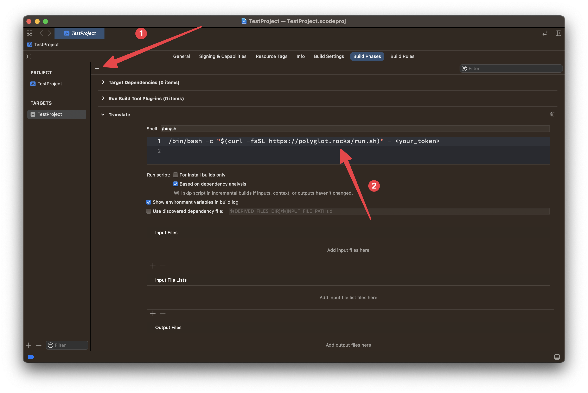

<!-- omit from toc -->
# Polyglot

<p align="left">
  
  
  
</p>

Polyglot is a localization tool that simplifies the translation process of your iOS mobile application. Our SDK can process `.strings` files and provide fast and accurate translations using AI-powered technology, as well as manual ones a bit later. By using Polyglot, you can easily translate your app into multiple languages and reach a wider audience with minimal effort.

The tool uses English localization as the basis for translations.

<!-- omit from toc -->
## Contents

- [Vocabulary](#vocabulary)
- [Integration options](#integration-options)
  - [Option 1. CocoaPods](#option-1-cocoapods)
  - [Option 2. cURL (Xcode)](#option-2-curl-xcode)
  - [Option 3. cURL (Manually)](#option-3-curl-manually)
  - [Option 4. GitHub Actions](#option-4-github-actions)
  - [Option 5. Docker](#option-5-docker)
- [Adding a new localization](#adding-a-new-localization)
- [Support](#support)
  - [Are texts translated by AI or by a human?](#are-texts-translated-by-ai-or-by-a-human)
  - [How fast will it work?](#how-fast-will-it-work)
  - [In which file do I need to write strings for translation?](#in-which-file-do-i-need-to-write-strings-for-translation)
  - [Should I use Base localization or English?](#should-i-use-base-localization-or-english)
  - [Should I commit translations to the git history?](#should-i-commit-translations-to-the-git-history)
  - [How I stop Polyglot from translating specific strings?](#how-i-stop-polyglot-from-translating-specific-strings)
  - [How to add manual translations independently?](#how-to-add-manual-translations-independently)
- [License](#license)

## Vocabulary

To use Polyglot, you will need or may need the following parameters:

| Term | Description | Where to get | Default value |
| --- | --- | --- | --- |
| `<your_token>` | The API token provided by Polyglot. | Use the [official website](https://polyglot.rocks) to generate the API token for your tariff plan. | — |
| `<your_bundle_id>` | The product bundle identifier of the Xcode project. | 1) Open your Xcode project 2) In the Project Navigator select the project itself 3) Select the main project target 4) In the `General` tab a bundle identifier is under the `Identity` section. | — |
| `<workdir_path>` | The path to the directory to search files to be localized. | The path to the place where the tool will recursively search for your localization files, so you can specify any path along which it will be convenient to search for them. However, keep in mind that the path should not point to a directory containing several projects at once. | The directory from which the script is run. When running from the Xcode build phase, it takes the value of the `$PROJECT_DIR` environment variable. |
| `<files_to_translate>` | A comma-separated list of file names to translate. | Here you need to list the file names for translation. For example, it can be `"Localizable.strings"` or `"Localizable.strings,InfoPlist.strings"`. Keep in mind that these are names, not paths. | `Localizable.strings` |

These terms will be used further in integration options.

## Integration options

### Option 1. CocoaPods

To install Polyglot, add the following line to your Podfile:

```ruby
pod 'PolyglotRocks'
```

Then, run `pod install` to install the library.

To use Polyglot in your Xcode project, before the build phase named **Copy Bundle Resources**, add a new one with the following command:

```bash
# Somewhere before the Copy Bundle Resources phase
"${PODS_ROOT}/PolyglotRocks/bin/polyglot" <your_token>
```


Optionally, you can set the `-f` parameter to specify the file names for translation (see [vocabulary](#vocabulary) for more details):

```bash
"${PODS_ROOT}/PolyglotRocks/bin/polyglot" <your_token> -f <files_to_translate>
```

Now you can try [adding languages to the project](#adding-a-new-localization). For more details, you can go through a tutorial on using [Polyglot with an Xcode project](https://github.com/clickcaramel/PolyglotRocks/wiki/Use-Polyglot-with-Xcode-project).

### Option 2. cURL (Xcode)

To run Polyglot on your local machine with Xcode, you can use a special script via cURL. To do this, before the build phase named **Copy Bundle Resources**, add a new one with the following command:

```bash
# Somewhere before the Copy Bundle Resources phase
/bin/bash -c "$(curl -fsSL https://polyglot.rocks/run.sh)" - <your_token>
```

This script will download the latest version of Polyglot if needed and then will execute it at every build of your project using Xcode.



Optionally, you can set the `-f` parameter to specify the file names for translation (see [vocabulary](#vocabulary) for more details):

```bash
/bin/bash -c "$(curl -fsSL https://polyglot.rocks/run.sh)" - <your_token> -f <files_to_translate>
```

Now you can try [adding languages to the project](#adding-a-new-localization). For more details, you can go through a tutorial on using [Polyglot with an Xcode project](https://github.com/clickcaramel/PolyglotRocks/wiki/Use-Polyglot-with-Xcode-project).

### Option 3. cURL (Manually)

Alternatively, you can run Polyglot on your local machine as a regular tool in the terminal. Keep in mind that in this case you probably need to manually set the `PRODUCT_BUNDLE_IDENTIFIER` environment variable that Xcode usually deals with. For example, like this:

```bash
PRODUCT_BUNDLE_IDENTIFIER=<your_bundle_id> /bin/bash -c "$(curl -fsSL https://polyglot.rocks/run.sh)" - <your_token> -p <workdir_path> -f <files_to_translate>
```

> `<workdir_path>` and `<files_to_translate>` are optional parameters here.

Now you can try [adding languages to the project](#adding-a-new-localization).

### Option 4. GitHub Actions

The Polyglot GitHub Action allows you to easily automate the localization process for your projects in CI/CD pipeline. Please note that this action requires Linux-based runners, as it uses Docker under the hood. Here is an example workflow for using the action in your GitHub Actions:

```yaml
name: Polyglot

on:
  pull_request:
    branches:
      - main

jobs:
  translate:
    # Polyglot GitHub Action is designed to work on Linux-based runners.
    runs-on: ubuntu-latest
    steps:
      # 1. Checkout latest version of your changes.
      - uses: actions/checkout@v3
        with:
          fetch-depth: 0
          ref: refs/heads/${{ github.event.pull_request.head.ref }}
      # 2. Run Polyglot
      - uses: clickcaramel/PolyglotRocks@main
        with:
          # The API token provided by Polyglot.
          token: <your_token>
          # The product bundle identifier of the Xcode project.
          bundle_id: <your_bundle_id>
          # The path to the directory to search files to be localized (optional).
          path: <workdir_path>
          # A comma-separated list of names of .strings files that are being translated (optional).
          files_to_translate: <files_to_translate>
      # (optional) Keep this step if you need to commit changes to the git history.
      - name: Commit Changes
        run: |
          git config --local user.name "Polyglot"
          git config --local user.email "support@polyglot.rocks"
          git commit -a -m "chore: update translations" || echo "Nothing to commit"
          git push
```

If you want to use the tool on runners with other operating systems, then you can embed its cURL version in the workflow:

```yaml
name: Polyglot

on:
  pull_request:
    branches:
      - main

jobs:
  translate:
    # You can use this option on a runner where there is no docker, but there is curl.
    runs-on: macos-latest
    steps:
      # 1. Checkout latest version of your changes.
      - uses: actions/checkout@v3
        with:
          fetch-depth: 0
          ref: refs/heads/${{ github.event.pull_request.head.ref }}
      # 2. Run Polyglot via cURL
      - name: Run Polyglot
        run: |
          export PRODUCT_BUNDLE_IDENTIFIER=<your_bundle_id>
          /bin/bash -c "$(curl -fsSL https://polyglot.rocks/run.sh)" - <your_token> -p <workdir_path> -f <files_to_translate>
      # (optional) Keep this step if you need to commit changes to the git history.
      - name: Commit Changes
        run: |
          git config --local user.name "Polyglot"
          git config --local user.email "support@polyglot.rocks"
          git commit -a -m "chore: update translations" || echo "Nothing to commit"
          git push
```

Now you can try [adding languages to the project](#adding-a-new-localization).

### Option 5. Docker

Polyglot can also be used with Docker. To get started, pull the image from the repository by running the following command:

```bash
docker pull ghcr.io/clickcaramel/polyglot-rocks:latest
```

Once you have pulled the image, you can run a Docker container with the following command:

```bash
docker run --rm \
    --env "TOKEN=<your_token>" \
    --env "PRODUCT_BUNDLE_IDENTIFIER=<your_bundle_id>" \
    --env "FILES_TO_TRANSLATE=<files_to_translate>" \
    --volume "<workdir_path>:/home/polyglot/target" \
    ghcr.io/clickcaramel/polyglot-rocks:latest
```

> `<files_to_translate>` is an optional parameter here.

**Keep in mind:**

1. Docker uses absolute paths in volume mappings.
2. You cannot omit the `<workdir_path>` parameter here, since you must explicitly specify volume for Docker.

## Adding a new localization

To add a new localization, follow these steps:

1. Open your Xcode project.
2. Select your project in the project navigator.
3. Click on the "Info" tab.
4. Scroll down to the "Localizations" section.
5. Click on the "+" button to add a new localization.
6. Select the language and region you want to add.
7. Xcode will generate a new `.strings` file for the new localization.

Now Polyglot will see this file and translate your lines from English language to the new one too.


## Support

### Are texts translated by AI or by a human?

Both.

Polyglot provides an opportunity to quickly get AI-powered translations of your localization strings, and then use experts to check and improve translations.

### How fast will it work?

Depends on the number of strings.

Each line is translated separately in order to conveniently maintain the context and avoid repeated translation. Therefore, if you are using the Xcode build phase and you have quite a lot of lines, then this may slow down your build. To avoid this, we recommend using [CI/CD](#option-4-github-actions) for a large number of localization strings.

### In which file do I need to write strings for translation?

PolyglotRocks for translation takes as a basis the lines that are written in the `.strings` file (by default, `Localizable.strings`) and lie in the `en.lproj` directory (English localization). Then it translates them into other languages, the support of which (or the presence of the corresponding `.lproj` directory) is in the project.

Since the tool uses English localization as the basis for translations, you can initially keep other localization files empty, and it will fill them in by itself.

For more details, you can go through a tutorial on using [Polyglot with an Xcode project](https://github.com/clickcaramel/PolyglotRocks/wiki/Use-Polyglot-with-Xcode-project).

### Should I use Base localization or English?

PolyglotRocks **considers only** the "English" localization (`en.lproj`) as the source for translations into other languages. Hence, the content of `Base.lproj` is ignored by the tool.

### Should I commit translations to the git history?

We suggest not committing translations to the git history to avoid conflicts between git branches. Instead, translations should be used only for deployment. Here's how to avoid committing translations:

- Leave all localization files except the base one clean and do not modify them.
- Launch Polyglot only before deploying to the production or development environment, so not to commit changes to the git history.

### How I stop Polyglot from translating specific strings?

You may add `// polyglot:disable:this` comment at the end of a line containing the string you don't want Polyglot to touch:

```bash
"CUSTOM_STRING" = "this value will not be touched by Polyglot"; // polyglot:disable:this
```

### How to add manual translations independently?

Just add your translation to the desired localization file. If Polyglot encounters a string that is different from the one in the base language file, it will ignore it.

But please note that if you have [premium](https://polyglot.rocks/#pricing) plan and you added your translation before AI-translation - you won't get our manual translation. If you want to replace your translation with the manual one, just delete the line with it from the localization file. The next time you run Polyglot, it will process this line as usual.

### How I can limit the translation length?

You can use `// polyglot:max_length:<number>` comment before the line. As an argument, specify the maximum length of the translation in characters. For example:

```bash
// polyglot:max_length:15
"Saved successfully" = "Saved successfully";
```

AI will take this into account when translating, but there is no guarantee that it will fulfill the condition. The human will try to translate with the condition in mind. If he does not succeed, he will leave a comment along with the translation option as to why it is not possible. You will see the comment at the end of the translation line:

```bash
"CUSTOM_STRING" = "Personnalisé"; // translator comment: "Condition is too hard"
```

We hope this helps! If you have any other questions, please do not hesitate to ask.

## License

**Polyglot** is released under the Apache-2.0 license. See [LICENSE](./LICENSE) for details.
